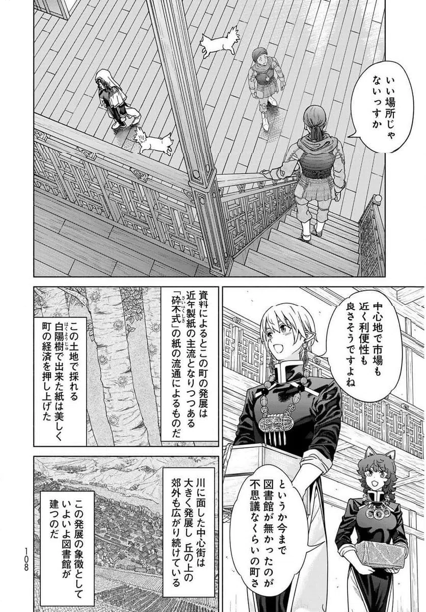
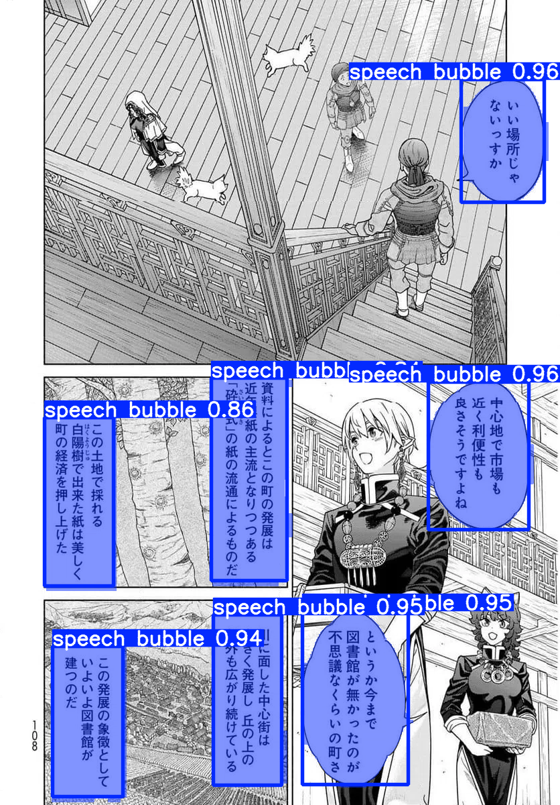
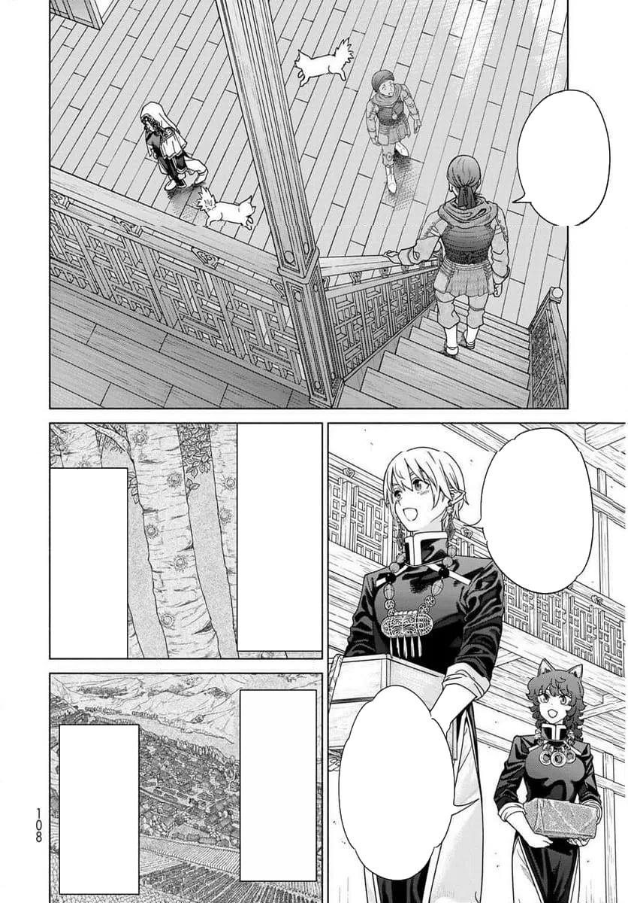
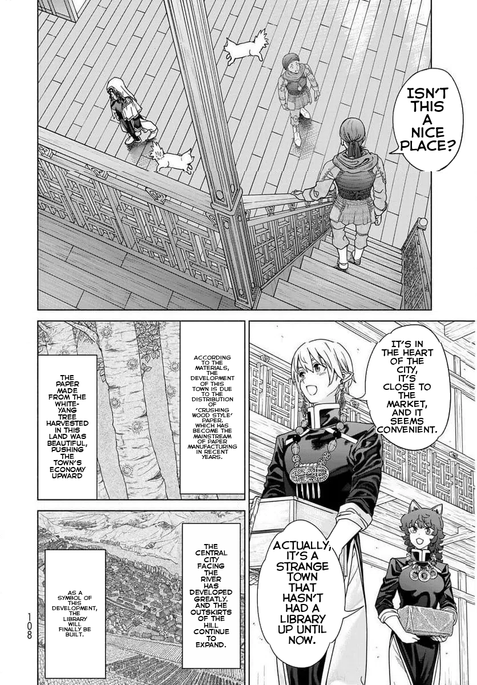
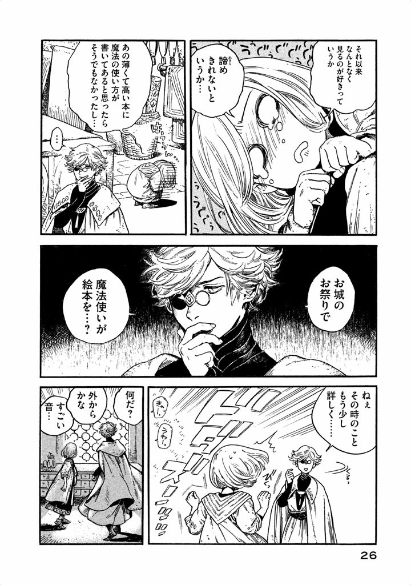
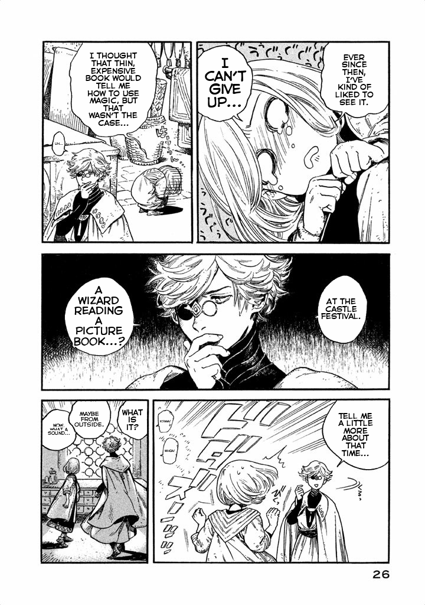
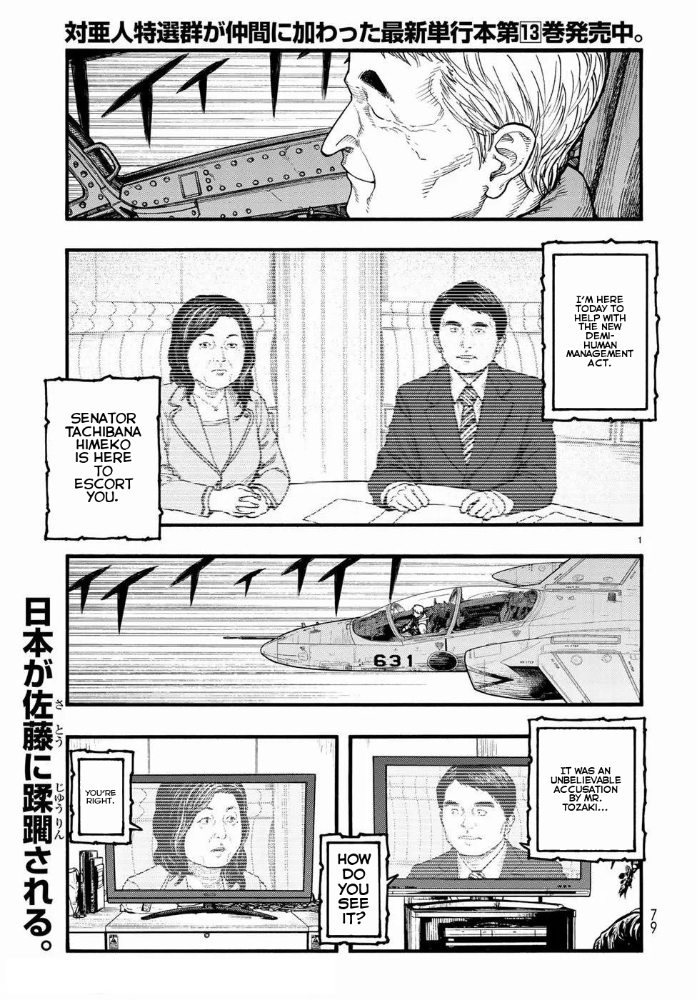

# Manga Translation CLI

Fully automated manga translation pipeline. Intelligently detects speech bubbles, extracts Japanese text with OCR, translates to English, and seamlessly renders translated text back onto pages with proper alignment and customizable fonts. Supports both single images and batch folder processing with GPU acceleration.

## Showcase

### Example 1: Complete Pipeline
| Original | Detection | Cleaned | Translated |
|----------|-----------|---------|------------|
|  |  |  |  |

*Source: Magus of the Library*

### Example 2: Translation Result
| Original | Translated |
|----------|------------|
|  |  |

*Source: Witch Hat Atelier*

| Original | Translated |
|----------|------------|
|  |  |

*Source: Ajin: Demi-Human*

**Pipeline stages:**
1. **Original**: Input manga page with Japanese text
2. **Detection**: YOLO model identifies speech bubble locations (green boxes)
3. **Cleaned**: Bubble interiors filled with base color, text removed
4. **Translated**: English text rendered within bubble shapes

## Table of Contents

- [Showcase](#showcase)
- [Features](#features)
- [Installation](#installation)
  - [Requirements](#requirements)
  - [Installing UV](#installing-uv)
  - [Setup](#setup)
  - [Models](#models)
- [Usage](#usage)
  - [Single Image Translation](#single-image-translation)
  - [Folder Translation](#folder-translation)
  - [Common Options](#common-options)
  - [Available Options](#available-options)
- [Output Structure](#output-structure)
- [Dependencies](#dependencies)
- [How It Works](#how-it-works)
- [Switching Between CPU and CUDA](#switching-between-cpu-and-cuda)
- [Limitations](#limitations)
- [Contributing](#contributing)
- [Credits](#credits)
- [Changelog](#changelog)
- [Notes](#notes)

## Features

- **Automatic speech bubble detection** using YOLO (YOLOv8m)
- **Japanese text extraction** using PaddleOCR-VL transformer model
- **High-quality translation** using Sugoi-v4 (specialized for Japanese→English)
- **Smart text rendering** with automatic font sizing and alignment within bubble shapes
- **Custom font support** for personalized text styling
- **Batch processing** for entire folders with optimized GPU utilization
- **GPU acceleration** with CUDA support for faster processing
- **Configurable detection** with adjustable confidence and IoU thresholds
- **Intermediate outputs** for debugging (bubble masks, cleaned images, detections)

## Installation

### Requirements

- Python 3.13 or higher
- UV package manager

For uv installation, visit: https://github.com/astral-sh/uv

### Setup

1. Clone or download this repository

2. **Select CPU or CUDA backend** (edit `pyproject.toml`):
   - Open `pyproject.toml`
   - Find `[tool.uv.sources]` section (line ~37)
   - Comment out CPU lines and uncomment CUDA lines for GPU
   - Comment out CUDA lines and uncomment CPU lines for CPU-only
   - Default: CUDA 12.8

3. **Install dependencies:**
   ```bash
   uv sync
   ```

### Models

Models will be automatically downloaded on first use:
- YOLO model for bubble detection
- PaddleOCR-VL model for text extraction
- Sugoi-v4 model for translation

## Usage

### Single Image Translation

```bash
manga-translate input/page1.png
```

### Folder Translation

```bash
manga-translate input/
```

### Common Options

Change output folder:
```bash
manga-translate input/page1.png --output folder --save-all
```

Save all intermediate outputs:
```bash
manga-translate input/page1.png --save-all
```

Use custom font:
```bash
manga-translate input/page1.png --font "fonts/CC Astro City Int Regular.ttf"
```

Adjust detection sensitivity:
```bash
manga-translate input/page1.png --conf-threshold 0.3 --iou-threshold 0.5
```

Force CPU mode (GPU is used by default if available):
```bash
manga-translate input/page1.png --device cpu
```

Quiet mode:
```bash
manga-translate input/page1.png --quiet
```

### Available Options

- `--output, -o`: Output folder path (default: output)
- `--folder, -f`: Process entire folder instead of single file
- `--conf-threshold`: Confidence threshold for bubble detection (0-1, default: 0.25)
- `--iou-threshold`: IoU threshold for NMS (0-1, default: 0.45)
- `--font`: Path to font file for translated text
- `--device`: Device for OCR and translation (cpu or cuda, default: auto-detect, uses cuda if available). Controls which device is used for both text extraction and translation.
- `--save-all`: Save all intermediate outputs
- `--save-speech-bubbles`: Save annotated detection images
- `--save-bubble-interiors`: Save bubble interior visualizations
- `--save-cleaned`: Save cleaned images before text drawing
- `--quiet, -q`: Suppress progress messages
- `--stop-on-error`: Stop processing on first error (folder mode)

For complete list of options:
```bash
manga-translate --help
```

## Output Structure

When processing files, outputs are organized in subdirectories:

- `translated/`: Final translated images (always saved)
- `speech_bubbles/`: Annotated images with detected bubbles (enabled with `--save-speech-bubbles`)
- `bubble_interiors/`: Visualization of bubble interiors (enabled with `--save-bubble-interiors`)
- `cleaned/`: Images with bubbles filled before text rendering (enabled with `--save-cleaned`)

Use `--save-all` to enable all intermediate outputs at once.

**Example output structure:**
```
output/
├── translated/
│   ├── page1.png
│   └── page2.png
├── speech_bubbles/      # if --save-speech-bubbles or --save-all
│   ├── page1.png
│   └── page2.png
├── bubble_interiors/    # if --save-bubble-interiors or --save-all
│   ├── page1.png
│   └── page2.png
└── cleaned/             # if --save-cleaned or --save-all
    ├── page1.png
    └── page2.png
```

## Dependencies

- ultralytics: YOLO model for bubble detection
- transformers: PaddleOCR-VL for text extraction
- ctranslate2: Fast translation inference
- sentencepiece: Text tokenization
- torch: Deep learning framework
- opencv-python: Image processing
- pillow: Image manipulation

## How It Works

1. Loads a YOLO model to detect speech bubbles in the image
2. Filters out parent boxes that contain smaller child boxes
3. For each bubble, extracts Japanese text using PaddleOCR-VL
4. Detects if text contains Japanese characters
5. Translates Japanese text to English using Sugoi-v4
6. Cleans bubble interiors by filling with base color
7. Renders translated text within bubble shapes using binary search for optimal font size
8. Saves the final translated image

## Switching Between CPU and CUDA

After installation, to change PyTorch backend:
1. Edit `pyproject.toml` `[tool.uv.sources]` section (comment/uncomment lines)
2. Run `uv sync`
3. Use `--device cuda` when running to use GPU

## Limitations
- Dense panels with overlapping bubbles have detection issues
- Text outside of bubbles won't be translated
- Complex bubble backgrounds may not fill cleanly
- Currently Japanese→English only; other languages not supported

## Contributing

Contributions welcome! To contribute:

1. Fork the repository
2. Create a feature branch (`git checkout -b feature/improvement`)
3. Make your changes
4. Run tests if applicable
5. Commit with clear messages (`git commit -m "Add feature"`)
6. Push to your fork (`git push origin feature/improvement`)
7. Open a Pull Request

**Development setup:**
```bash
git clone <your-fork>
cd manga-translator-cli
# Edit pyproject.toml for CPU/CUDA preference
uv sync
```

**Areas for contribution:**
- Improved bubble detection algorithms
- Translation for text outside of bubbles
- Support for additional languages
- UI/web interface
- Performance optimizations
- Documentation improvements

## Credits

**Models:**
- [YOLOv8m Manga Bubbles](https://huggingface.co/Oguzhan61/yolov8m_manga_bubbles) by Oguzhan61 - Speech bubble detection
- [PaddleOCR-VL For Manga](https://huggingface.co/jzhang533/PaddleOCR-VL-For-Manga) by jzhang533 - Japanese text extraction
- [Sugoi-v4 JA-EN](https://huggingface.co/entai2965/sugoi-v4-ja-en-ctranslate2) by entai2965 - Japanese to English translation

**Libraries:**
- [Ultralytics](https://github.com/ultralytics/ultralytics) - YOLO implementation
- [Transformers](https://github.com/huggingface/transformers) - HuggingFace transformers library
- [CTranslate2](https://github.com/OpenNMT/CTranslate2) - Fast inference engine
- [PyTorch](https://pytorch.org/) - Deep learning framework
- [UV](https://github.com/astral-sh/uv) - Fast Python package manager

## Notes

- First run downloads models (several minutes)
- Translation quality depends on text clarity and font style
- GPU requires CUDA 12.8-compatible NVIDIA GPU + drivers
- `--device` controls both OCR and translation device
- Supported formats: PNG, JPG, JPEG, WEBP

